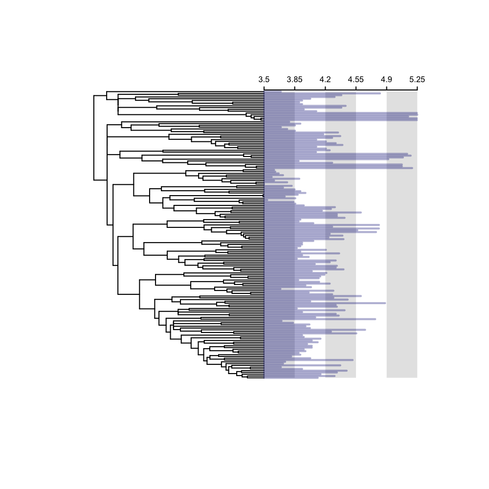
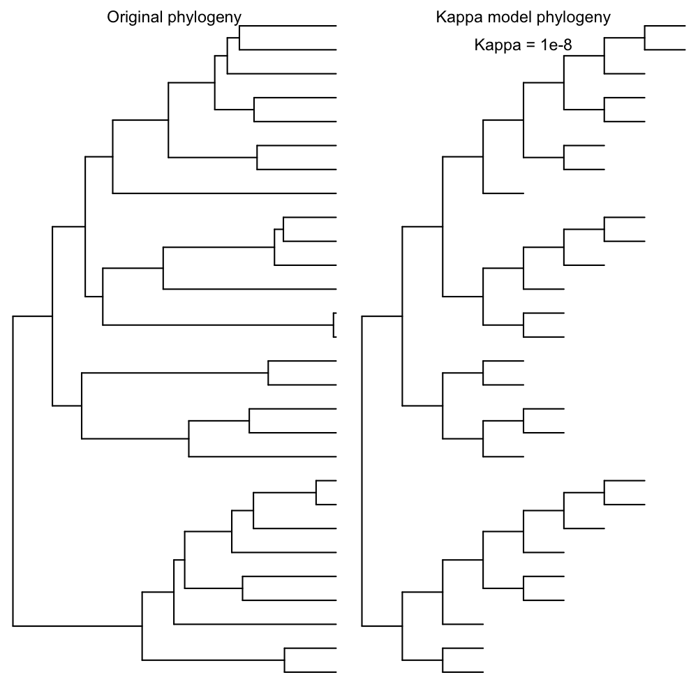
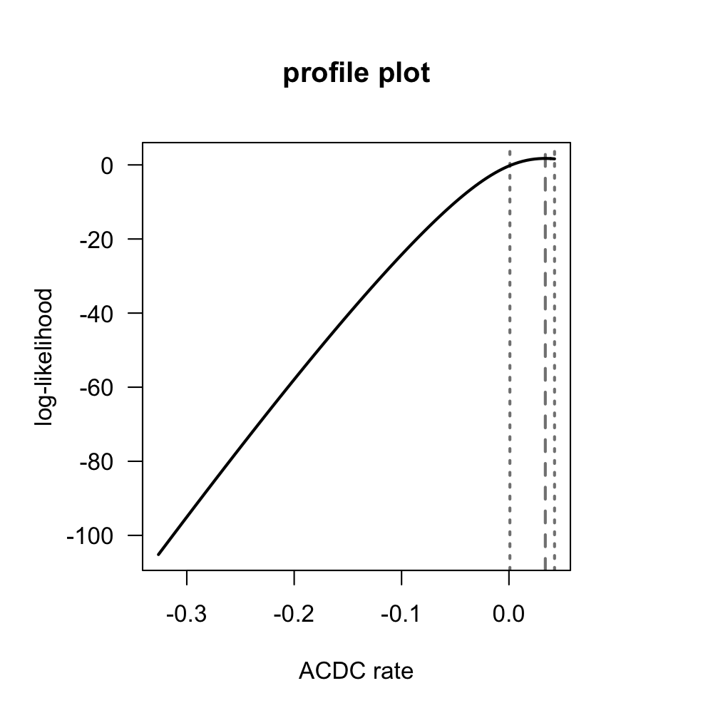
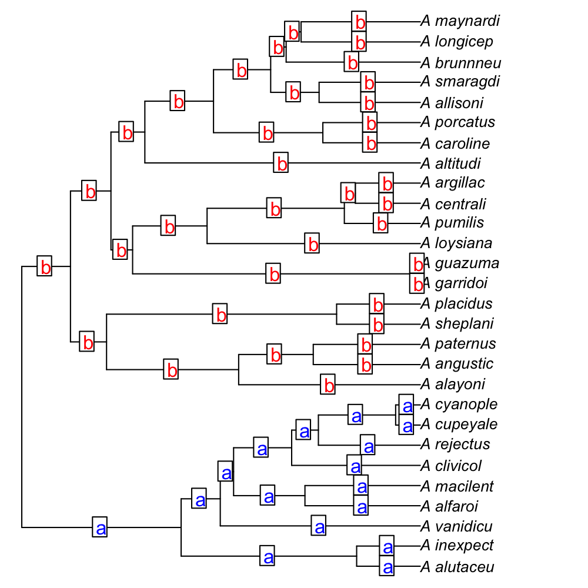
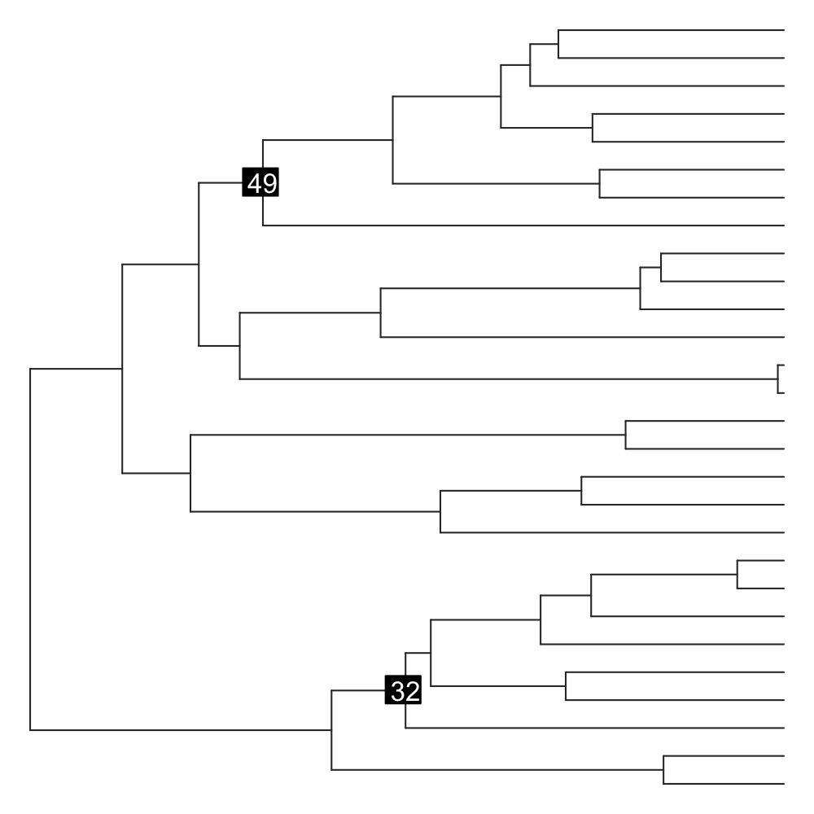
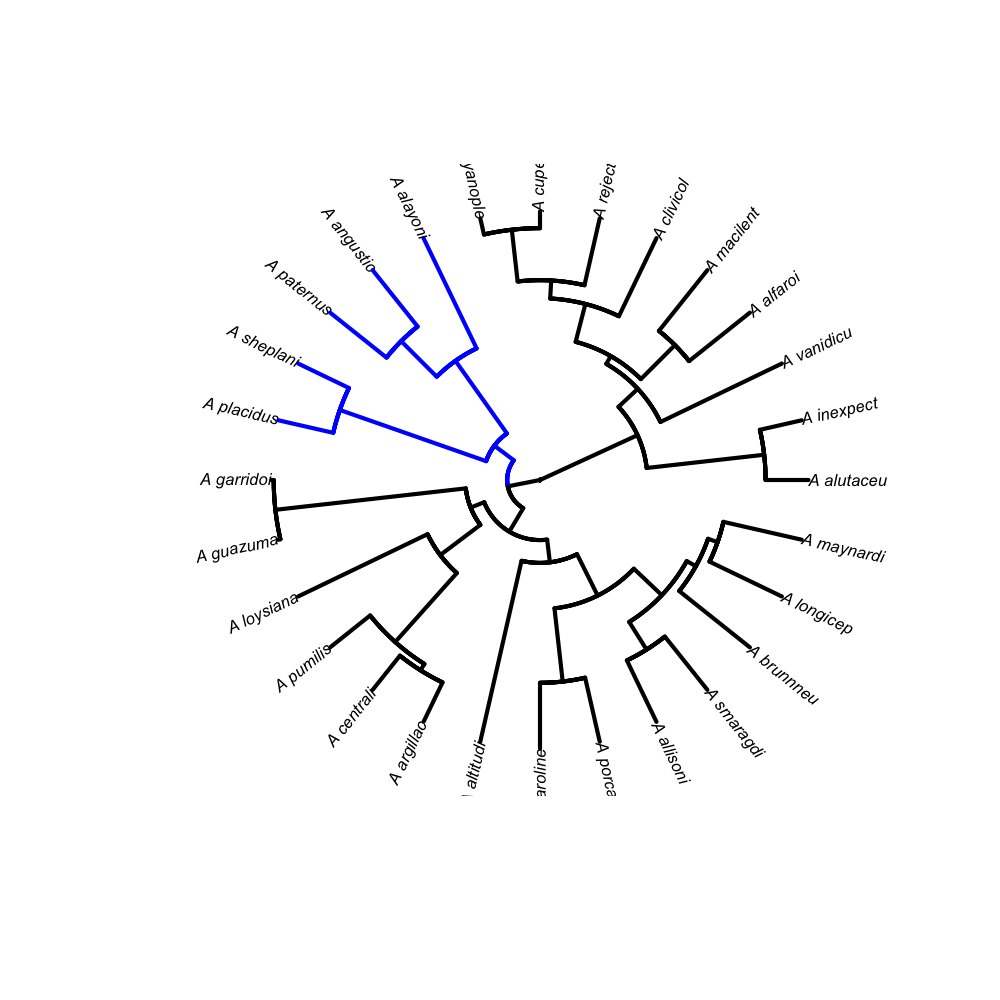
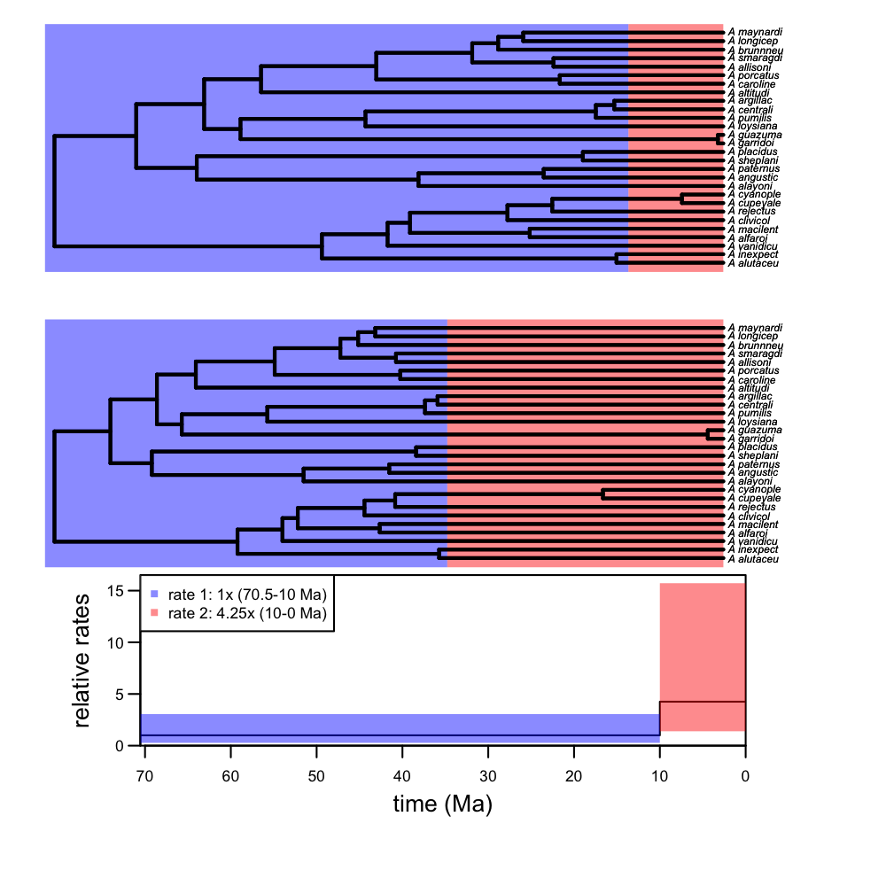
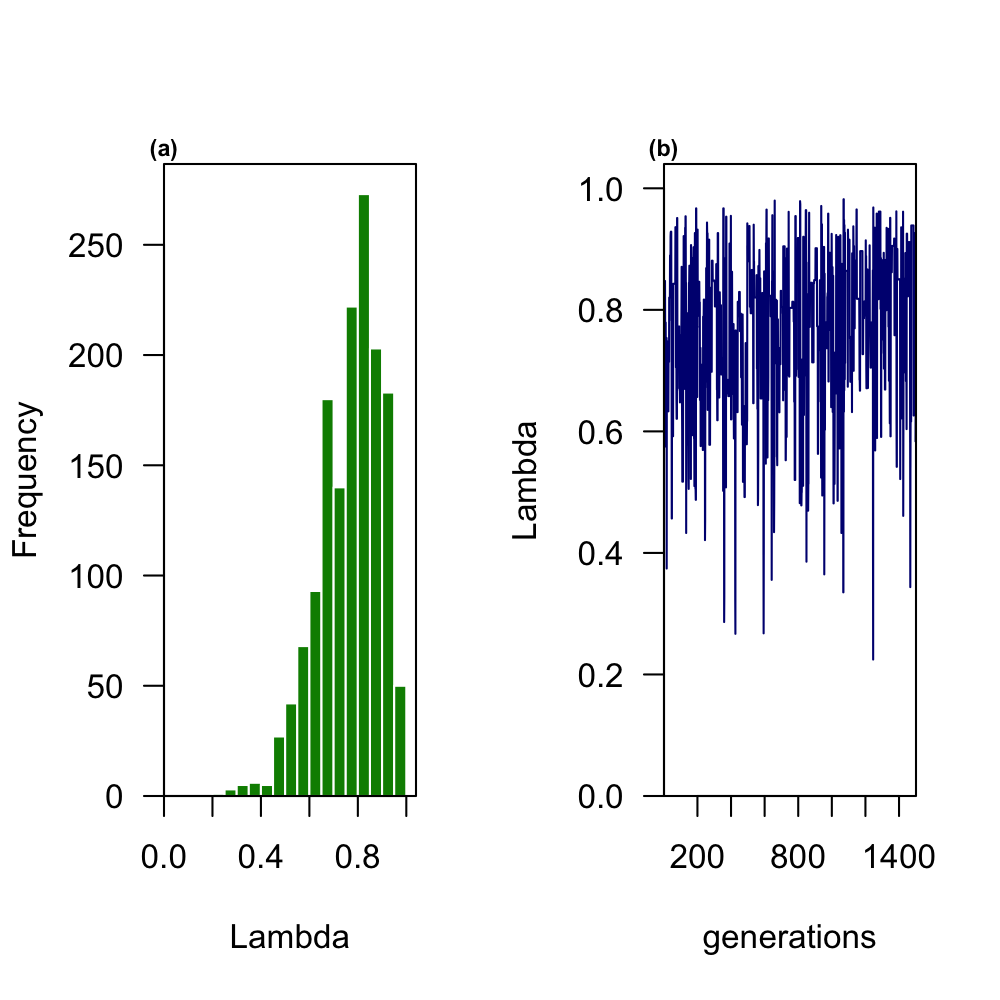

<!DOCTYPE html>

<html xmlns="http://www.w3.org/1999/xhtml">

<head>

<meta charset="utf-8" />
<meta http-equiv="Content-Type" content="text/html; charset=utf-8" />
<meta name="generator" content="pandoc" />
<meta name="author" content="Mark Puttick" />
<meta name="date" content="2018-10-22" />
<title>motmot.2.0</title>

Models Of Trait Macroevolution On Trees (MOTMOT) is an R package that allows for testing of models of trait evolution (Thomas <em>et al.</em> 2012).

<ul>
<li><a href="#models-of-trait-evolution">Tree transformation</a> models estimated using Maximum likelihood: <a href="#brownian-motion">Brownian motion</a>, <a href="pagels-lambda">Pagel’s Lambda</a>, <a href="#delta">Delta</a>, <a href="#kappa">Kappa</a>, <a href="#ornstein-uhlenbeck">Ornstein-Uhlenbeck (OU)</a>, <a href="#ACDC-and-Early-Burst">Acceleration-Deaceleration (ACDC) and early bursts</a>, <a href="#psi%20and%20multispi">psi and multispi</a>, and <a href="#estimate-lambda-alongside-models">estimating lambda alongside other models</a></li>
<li><a href="#rate-heterogeneous-models-of-evolution">Rate heterogeneous models of evolution</a>. Fit models in which the rate of evolution differs in clades selected <a href="#rate-heterogeneity-selected-a-priori"><em>a priori</em></a> (O’Meara <em>et al.</em> 2006; Thomas <em>et al.</em> 2006), and models with <a href="#rate-heterogeneity-with-no-a-priori-information">no <em>a-priori</em> shift locations</a> (Thomas <em>et al.</em> 2012)</li>
<li><a href="#time-slice-model">TimeSlice</a> fit models in which all rates change at a specific time(s) by tested all times or those selected by the user</li>
<li><a href="#nested-models-of-evolution">Nested Shift mode</a> Fit models models in which the ancestral BM rate switches to a ‘nested’ rate within a monophyletic clade in the phylogeny</li>
<li><a href="#bayesian-estimation-of-tree-transformation-models">Bayesian estimation</a> of tree transformation models</li>
<li><a href="#character-displacement-models">Character displacement models</a> of inter-specific competition from Clarke <em>et al.</em> (2017)</li>
<li><a href="#fast-estimation-of-phylogenetic-generalised-least-squares">Fast estimation of Phylogenetic Generalised Least Squares (PGLS)</a> using independent contrasts</li>
</ul>

<h1>Introduction</h1>

First we load motmot.2.0

<pre class="r"><code>library(motmot.2.0, quietly=T)</code></pre>

For these examples we will use anolis data available from motmot. A time-calibrated phylogeny of anolis species (“anolis.tree”), and various trait and biogeographical trait data (“anolis.data”)

<pre class="r"><code>data(anolis.tree)
data(anolis.data)

attach(anolis.data)
anolis.tree</code></pre>
<pre><code>## 
## Phylogenetic tree with 165 tips and 164 internal nodes.
## 
## Tip labels:
##  A_occultus, A_darlingt, A_monticol, A_bahoruco, A_dolichoc, A_henderso, ...
## Node labels:
##  2, 2, 2, 2, 2, 2, ...
## 
## Rooted; includes branch lengths.</code></pre>

We will use the continuous trait data: male snout-ventral length ‘Male_SVL’. We will construct a matrix of just these data, remove missing data, and log-transform the values. All this can be done using the function ‘sortTraitData’

<pre class="r"><code>sortedData &lt;- sortTraitData(phy=anolis.tree, y=anolis.data, data.name=&quot;Male_SVL&quot;, pass.ultrametric = TRUE)
phy &lt;- sortedData$phy
male.length &lt;- sortedData$trait</code></pre>

Finally, we will ‘prune’ the species from the tree using ‘drop.tip’ from APE. We can now plot our tree and data using the “traitData.plot” function

<pre class="r"><code>traitData.plot(y=male.length, phy)</code></pre>

Figure 1. TraitData showing the relative male snout ventral length at the tips

We will fit the “tm2” model that allows for clade- and branch-specific changes in rate. This uses the familiar function ‘transformPhylo.ML’. We will fit the models to a subset of these data: including the clade from node 182 only using the APE (Paradis <em>et al</em> 2018) function ‘extract.clade’

<pre class="r"><code>plot(phy, show.tip.label=FALSE, no.margin=TRUE, edge.col=&quot;grey20&quot;)
nodelabels(182, 182, bg=&quot;black&quot;, col=&quot;white&quot;)</code></pre>

Figure 2. Subset of the anolis tree

<pre class="r"><code>phy.clade &lt;- extract.clade(phy, 182)
male.length.clade &lt;- as.matrix(male.length[match(phy.clade$tip.label, rownames(male.length)),])</code></pre>

<h1>Models of trait evolution</h1>

We can now test various models of evolution using our trait data.

<h2>Brownian motion</h2>

To start we will fit a simple Brownian motion model to the data, as the null hypothesis of phylogenetic trait evolution (Cavalli-Sforza and Edwards 1967; Felsenstein 1973; 1985). Brownian motion describes a process in which tip states are a multi-variate normal distribution . On a phylogeny, the multi-variate mean of tip states is equal to the root state estimate, and variance accummulates linearly through time. Until a lineages split on a tree trait evolution is shared, but following a split individual branches evolve and accummulate variance independently from their shared ancestral value.

<pre class="r"><code>bm.ml &lt;- transformPhylo.ML(phy=phy.clade, y=male.length.clade, model=&quot;bm&quot;)
bm.ml</code></pre>
<pre><code>## $brownianVariance
##             [,1]
## [1,] 0.001858067
## 
## $logLikelihood
## [1] -0.2838382
## 
## $root.state
## [1] 3.849481
## 
## $AIC
## [1] 4.567676
## 
## $AICc
## [1] 5.047676</code></pre>

<h2>Pagel’s lambda</h2>

We can also fit models to test Pagel’s lambda (Pagel 1997; 1999). Pagel’s lambda is a measure of phylogenetic ‘signal’ in which the degree to which shared history of taxa has driven trait distributions at tips. In this model, internal branche lengths are changed by the lambda value. If lambda is 1, then branches are equal to a Brownian motion model (high phylogenetic signal), and lower values of lambda indicate less influence of shared history on trait values at the tips. Finally, a value of 0 indicates no phylogenetic influence on trait distributions, and is equivalent to a ‘star phylogeny’ with no shared branch lengths.

The maximum likelihood of lambda can be estimate in motmot.2.0

<pre class="r"><code>lambda.ml &lt;- transformPhylo.ML(phy=phy.clade, y=male.length.clade, model=&quot;lambda&quot;)
lambda.ml</code></pre>
<pre><code>## $MaximumLikelihood
## [1] 6.522191
## 
## $Lambda
##      MLLambda   LowerCI   UpperCI
## [1,] 0.836999 0.5259423 0.9742338
## 
## $brownianVariance
##              [,1]
## [1,] 0.0008245374
## 
## $root.state
## [1] 3.853432
## 
## $AIC
## [1] -7.044383
## 
## $AICc
## [1] -6.044383</code></pre>

The maximum likelhood estimate of Pagel’s Lambda is equal to 0.83

A new feature in motmot allows for plotting of the likelihood profile for the branch-transformation parameter, in this case Pagel’s lambda

<pre class="r"><code>lambda.ml &lt;- transformPhylo.ML(phy=phy.clade, y=male.length.clade, model=&quot;lambda&quot;, profilePlot=T)</code></pre>

Figure 3. Profile plot of ML estimation for Pagel’s lambda

We can now compare the fit of the BM and Lambda models. Lambda has higher likelihood, but it also has more parameters (the root state and sigma squared are shared in both models, lambda also estimates the lambda parameter). We can test whether this is a significant improvement. First we will use the chi-squared distribution. The models differ in one degree of freedom: BM has 2 parameters (brownian variance, root state) and lambda has those two parameters plus the value of lambda, so 3 parameters. We can use the stats function pchisq to obtain a p value, and see that lambda is indeed a superior fit to these data

<pre class="r"><code>p.value &lt;- 1 - pchisq(lambda.ml$MaximumLikelihood - bm.ml$logLikelihood, 1)
p.value</code></pre>
<pre><code>## [1] 0.009085056</code></pre>

Additionally there is a large Akaike Information Criterion (AICc) difference between the two models: BM has a higher AICc compared to Lambda. The differce (11.09) is &gt;4 which is tradtionally seen as indication of a superior fit (Burnham and Anderson 2003).

<pre class="r"><code>bm.ml$AICc- lambda.ml$AICc</code></pre>
<pre><code>## [1] 11.09206</code></pre>

The parameters, brownian variance, root state, Maximum likelihoods, AIC, and AICc can be obtained for a number of models in motmot.

<h2>Delta</h2>

Delta indicates a slow or increase in the rate of trait evolution through time (Pagel 1997; 1999); a value of 1 is equivalent to Brownian motion, &lt; 1 indicates a slow-down, and &gt; 1 is difficult to interpret (greater change near the present). Here we find a MLE of 2.23 but the CI spans &lt; 1 to &gt; 4

<pre class="r"><code>delta.ml &lt;- transformPhylo.ML(phy=phy.clade, y=male.length.clade, model=&quot;delta&quot;, profilePlot=T)</code></pre>

Figure 4. Profile plot to estimate delta

<pre class="r"><code>delta.ml</code></pre>
<pre><code>## $MaximumLikelihood
## [1] 1.179797
## 
## $Delta
##       MLDelta   LowerCI  UpperCI
## [1,] 2.231464 0.8477531 4.660712
## 
## $brownianVariance
##              [,1]
## [1,] 6.013994e-06
## 
## $root.state
## [1] 3.8843
## 
## $AIC
## [1] 3.640407
## 
## $AICc
## [1] 4.640407</code></pre>

<h2>Kappa</h2>

Kappa is used as a measure of punctuated evolution and spans values of 0-1 (Pagel 1997:1999). 1 is equivalent to BM, and 0 indicates trait change occurs at events of speciation. Here there is evidence of punctuated evolution (the warning message simply tells out the CI falls outside the parameter bounds - in this case below zero).

<pre class="r"><code>kappa.ml &lt;- transformPhylo.ML(phy=phy.clade, y=male.length.clade, model=&quot;kappa&quot;, profilePlot=T)</code></pre>

Figure 5. Profile plot to estimate kappa

<h2>Ornstein-Uhlenbeck</h2>

The OU model allows for modelling of attraction to a optimum value, alpha (Hansen 1997; Butler and King 2004). This model again is similar to the Brownian motion model, but models the strength of attraction to alpha. THe OU model can be difficult to interpret and care is advised in its use (Cooper <em>et al.</em> 2016).

In motmot.2.0, as with most implements of the phylogenetic OU model, the value of attraction parameter is equal to the ancestral trait estimate.

<pre class="r"><code>ou.ml &lt;- transformPhylo.ML(phy=phy.clade, y=male.length.clade, model=&quot;OU&quot;, profilePlot=T)</code></pre>

Figure 6. Profile plot to estimate alpha

<pre class="r"><code>ou.ml</code></pre>
<pre><code>## $MaximumLikelihood
## [1] 1.743459
## 
## $Alpha
##         MLAlpha      LowerCI    UpperCI
## [1,] 0.01693504 0.0004499009 0.03912295
## 
## $brownianVariance
##             [,1]
## [1,] 0.002824058
## 
## $root.state
## [1] 3.876704
## 
## $AIC
## [1] 2.513082
## 
## $AICc
## [1] 3.513082</code></pre>

The value of alpha is higher than zero, but very small (0.01692855). So the model is not equivalent to Brownian motion but there is little evidence from AICc that the model is an improvement, and the likelihood ratio test show a non-significant improvement

<pre class="r"><code>p.value &lt;- 1 - pchisq(ou.ml$MaximumLikelihood - bm.ml$logLikelihood, 1)
p.value</code></pre>
<pre><code>## [1] 0.1544952</code></pre>
<pre class="r"><code>bm.ml$AICc- ou.ml$AICc</code></pre>
<pre><code>## [1] 1.534594</code></pre>

<h2>ACDC and Early Burst</h2>

A new addition to MOTMOT is the ACDC model (Blomberg <em>et al.</em> 2003). This model allows for exponential changes in the rate of evolution in the history of a clade.

<pre class="r"><code>acdc.ml &lt;- transformPhylo.ML(phy=phy.clade, y=male.length.clade, model=&quot;ACDC&quot;, profilePlot=T)</code></pre>

Figure 7. Profile plot to estimate the ACDC parameter

<pre class="r"><code>acdc.ml</code></pre>
<pre><code>## $MaximumLikelihood
## [1] 1.743459
## 
## $ACDC
##          MLacdc     LowerCI    UpperCI
## [1,] 0.03385981 0.000879245 0.04246516
## 
## $brownianVariance
##              [,1]
## [1,] 0.0002590746
## 
## $root.state
## [1] 3.876696
## 
## $AIC
## [1] 2.513082
## 
## $AICc
## [1] 3.513082</code></pre>

There is little evidence here of exponential decreases or increases in the rate of trait evolution - the acdc exponential parameter is close to 0 (0.034). We can see this is not a significant improvement on BM

<pre class="r"><code>p.value.2 &lt;- 1 - pchisq(acdc.ml$MaximumLikelihood - bm.ml$logLikelihood , 1)
p.value.2</code></pre>
<pre><code>## [1] 0.1544951</code></pre>

As an example, here we constrain the ‘upperBound’ to &lt; 0, this is equivalent to the Early Burst model (Harmon <em>et al.</em> 2010) fit in geiger

<pre class="r"><code>transformPhylo.ML(phy=phy.clade, y=male.length.clade, model=&quot;ACDC&quot;, profilePlot=FALSE, upperBound=-1e-6, print.warning=FALSE)</code></pre>
<pre><code>## $MaximumLikelihood
## [1] -0.2839606
## 
## $ACDC
##      MLacdc     LowerCI UpperCI
## [1,] -1e-06 -0.01322547  -1e-06
## 
## $brownianVariance
##             [,1]
## [1,] 0.001858181
## 
## $root.state
## [1] 3.849481
## 
## $AIC
## [1] 6.567921
## 
## $AICc
## [1] 7.567921</code></pre>

The estimate of -1e-6 for the exponential decrease parameter, means the model is effectively equivalent to Brownian motion

<h2>psi and multispi</h2>

The parameter psi is similar to the parameter kappa in that it measures the relative contribution of speciational (~punctuated) and gradual evolution to trait change (Ingram 2011; Ingram <em>et al.</em> 2016). The parameter psi is based upon measures of evolution over time and at speciation, and can also account for ‘hidden’ nodes not seen in the input phylogeny. The parameter psi measures the proportion of speciational change and background time, so the estimation for psi between 0 (Brownian motion) and 1 (indicating equal branch lengths, ~speciational change).

In motmot we can fit a simple psi model using the input tree.

<pre class="r"><code>psi.ml &lt;- transformPhylo.ML(phy=phy.clade, y=male.length.clade, model=&quot;psi&quot;, profilePlot=T)</code></pre>

Figure 8. Profile plot to estimate the psi parameter

<pre class="r"><code>psi.ml</code></pre>
<pre><code>## $MaximumLikelihood
## [1] 8.495569
## 
## $psi
##      MLpsi  LowerCI UpperCI
## [1,]     1 0.316058       1
## 
## $brownianVariance
##              [,1]
## [1,] 0.0008018518
## 
## $root.state
## [1] 3.761269
## 
## $AIC
## [1] -10.99114
## 
## $AICc
## [1] -9.991139</code></pre>

This indicates support for the psi model but it is not a significant improvement on Brownian motion

<pre class="r"><code>p.value.psi &lt;- 1 - pchisq(acdc.ml$MaximumLikelihood - bm.ml$logLikelihood , 1)
p.value.psi</code></pre>
<pre><code>## [1] 0.1544951</code></pre>

We could also get a potentially more accurate of speciation rates by using the full tree, rather than the pruned tree. If death rates are over 0, then the estimates will differ from the simple model above.

<pre class="r"><code>transformPhylo.ML(phy=phy.clade, y=male.length.clade, model=&quot;psi&quot;, profilePlot=FALSE, hiddenSpeciation=TRUE, full.phy=phy)</code></pre>
<pre><code>## $MaximumLikelihood
## [1] 8.495569
## 
## $psi
##      MLpsi  LowerCI UpperCI
## [1,]     1 0.316058       1
## 
## $brownianVariance
##              [,1]
## [1,] 0.0008018518
## 
## $root.state
## [1] 3.761269
## 
## $AIC
## [1] -10.99114
## 
## $AICc
## [1] -9.991139</code></pre>

In this case, there is no difference in the estimates as death rates are equal to 0

We can also apply multipsi model in which different regions of the tree have different estimates of the parameter psi

<pre class="r"><code>plot(phy.clade, no.margin=TRUE, cex=0.8)
two.clade.labels &lt;- c(rep(&quot;a&quot;, 17), rep(&quot;b&quot;,37))
edgelabels(two.clade.labels, col=c(rep(&quot;blue&quot;, 17), rep(&quot;red&quot;, 37)), bg=&quot;white&quot;)</code></pre>

Figure 9. Two clades used in the multipsi model

We can now fit the multispi model with these data

<pre class="r"><code>transformPhylo.ML(phy=phy.clade, y=male.length.clade, model=&quot;multipsi&quot;, branchLabels=c(rep(&quot;a&quot;, 17), rep(&quot;b&quot;,37)), hiddenSpeciation=TRUE, full.phy=phy)</code></pre>
<pre><code>## $MaximumLikelihood
## [1] 8.495569
## 
## $psi
##   MLpsi    LowerCI UpperCI
## a     1 0.04812257       1
## b     1 0.20955316       1
## 
## $brownianVariance
##              [,1]
## [1,] 0.0008018518
## 
## $root.state
## [1] 3.761269
## 
## $AIC
## [1] -8.991139
## 
## $AICc
## [1] -7.252008</code></pre>

In this model, the estimate of psi does not differ between the two regions of the tree

<h2>Estimate lambda alongside models</h2>

One way to deal with ‘noisy’ data is to estimate Pagel’s lambda alongside a parameter of interest. In motmot, lambda can be estimated alongside the delta, kappa, OU, psi, and ACDC models. Here we look at example using ACDC. The model is fit with same function. ‘transformPhyo.ML’, but with the argument ‘lambdaEst’ set to TRUE

<pre class="r"><code>acdc.ml.lambda &lt;- transformPhylo.ML(phy=phy.clade, y=male.length.clade, model=&quot;ACDC&quot;, lambdaEst=T)
# original ACDC model
acdc.ml</code></pre>
<pre><code>## $MaximumLikelihood
## [1] 1.743459
## 
## $ACDC
##          MLacdc     LowerCI    UpperCI
## [1,] 0.03385981 0.000879245 0.04246516
## 
## $brownianVariance
##              [,1]
## [1,] 0.0002590746
## 
## $root.state
## [1] 3.876696
## 
## $AIC
## [1] 2.513082
## 
## $AICc
## [1] 3.513082</code></pre>
<pre class="r"><code># ACDC model plus lambda
acdc.ml.lambda</code></pre>
<pre><code>## $MaximumLikelihood
## [1] 7.376867
## 
## $ACDC
##          MLacdc    LowerCI     UpperCI
## [1,] -0.1829327 -0.3243722 -0.08289057
## 
## $brownianVariance
##            [,1]
## [1,] 0.01272375
## 
## $root.state
## [1] 3.836039
## 
## $lambda
## [1] 0.1389117
## 
## $AIC
## [1] -4.753735
## 
## $AICc
## [1] -2.026462</code></pre>

We can see lambda is &lt; 1, and this has affected the parameter estimation. The improvement in the model fit is significant compared to the ACDC model without lambda, and the null BM model

<pre class="r"><code># p value of the ACDC and ACDC+lambda models. No significant improvement
1 - pchisq(acdc.ml.lambda$MaximumLikelihood - acdc.ml$MaximumLikelihood , df=1)</code></pre>
<pre><code>## [1] 0.01762134</code></pre>
<pre class="r"><code># p value of the BM and ACDC+lambda model comparison. No significant improvement
1 - pchisq(acdc.ml.lambda$MaximumLikelihood - bm.ml$logLikelihood, df=2)</code></pre>
<pre><code>## [1] 0.02170196</code></pre>

<h1>Rate heterogeneous models of evolution</h1>

<h2>rate heterogeneity selected <em>a priori</em></h2>

MOTMOT can test models of evolution in which pre-defined clades can vary in the rate of evolution. Here we fit a model in which the nodes descending from nodes 32 and 49 have a seperate rate of evolution. We can visualise these nodes on the phylogeny

<pre class="r"><code>plot(phy.clade, show.tip.label=F, no.margin=T, edge.col=&quot;grey20&quot;)
nodelabels(c(32, 49), c(32, 49), bg=&quot;black&quot;, col=&quot;white&quot;)</code></pre>

Figure 10. Lineages with different rates of evolution

We then fit the motmot model, again using the function transformPhylo.ML. We use the argument “model=clade”. This fits the non-censored model of O’Meara <em>et al.</em> (2006).

<pre class="r"><code>cladeRate.ml &lt;- transformPhylo.ML(phy=phy.clade, y=male.length.clade, model=&quot;clade&quot;, nodeIDs=c(32, 49))
cladeRate.ml</code></pre>
<pre><code>## $Rates
##      node    MLRate   LowerCI  UpperCI
## [1,]   32 0.8138100 0.2632955 3.263628
## [2,]   49 0.6819079 0.1896347 2.952364
## 
## $MaximumLikelihood
## [1] -0.1462557
## 
## $brownianVariance
##             [,1]
## [1,] 0.002143258
## 
## $root.state
## [1] 3.870488
## 
## $AIC
## [1] 8.292511
## 
## $AICc
## [1] 10.03164</code></pre>

These results indicate that the two clades tend to have a lower rate of evolution compared to the background rate. However, the CIs indicate these decreases may not be robust

<h2>rate heterogeneity with no <em>a priori</em> information</h2>

We can also fit rate heterogeneous models without specifying where we expect shifts on the tree. We can use the arguments “model=”tm1“” and “model=”tm2“”; these models fit ‘traitMedusa’ models in which all nodes are tested for rate increases or decreases. It is possible to exclude small nodes using the argument ‘minCladeSize’. As well as allowing clade differences in rate, the “tm2” also allows for branch-based increases or decreases in rate.

We can now fit the ‘tm2’ algorithm. The output shows the log-likelihood, AIC, AICc, rate type (branch of clade), for the best-fitting model at each stage. This starts with the BM model, and then one shift model, two shift model, etc.,

<pre class="r"><code># not run
# tm1.ml &lt;- transformPhylo.ML(y=male.length.clade, phy=phy.clade, model=&quot;tm1&quot;, minCladeSize=2, nSplits=3)
# trait.medusa.tm1.summary &lt;- traitMedusaSummary(tm1.ml, cutoff=2, AICc=T)
tm2.ml &lt;- transformPhylo.ML(y=male.length.clade, phy=phy.clade, model=&quot;tm2&quot;, minCladeSize=5, nSplits=2)</code></pre>
<pre><code>## 
##  BM model
##         node shiftPos        lnL n.params      AIC     AICc
## BM         0        1 -0.2838382        2 4.567676 5.047676
## 
##  Shift 1
##         node shiftPos      lnL n.params         AIC     AICc     rate.1
## shift.1   39    clade 3.042358        3 -0.08471602 0.915284 0.09148646
## 
##  Shift 2
##         node shiftPos      lnL n.params       AIC     AICc    rate.1
## shift.2   44    clade 4.746785        5 0.5064296 3.233702 0.1408068
##           rate.2
## shift.2 3.158565</code></pre>

We can now summarise the results of these data using ‘traitMedusaSummary’ and plotting the shifts on the phylogeny using ‘plotPhylo.motmot’. These results show a decrease at node 39 that we can visualise on the phylogeny.

<pre class="r"><code>trait.medusa.tm2.summary &lt;- traitMedusaSummary(tm2.ml, cutoff=2, AICc=T)
trait.medusa.tm2.summary</code></pre>
<pre><code>## $ModelFit
##              lnL n.params         AIC     AICc
## shift.1 3.042358        3 -0.08471602 0.915284
## 
## $Rates
##   node shiftPos             MLRate            LowerCI           UpperCI
## 1   39    clade 0.0914864604723702 0.0260301808222033 0.500374159059036
## 
## $optimalTree
## 
## Phylogenetic tree with 28 tips and 27 internal nodes.
## 
## Tip labels:
##  A_alutaceu, A_inexpect, A_vanidicu, A_alfaroi, A_macilent, A_clivicol, ...
## Node labels:
##  2, 2, 2, 2, 2, 2, ...
## 
## Rooted; includes branch lengths.</code></pre>
<pre class="r"><code>colour_motmot &lt;- plotPhylo.motmot(phy=phy.clade, traitMedusaObject=trait.medusa.tm2.summary, reconType = &quot;rates&quot;, type = &quot;fan&quot;, cex=0.5, edge.width=2)</code></pre>

Figure 11. The subset of the tree showing the rate heterogeneity estimated from the traitMedusa model

Thomas and Freckleton (2012) showed the tm2 algortihm has a high type-one error rate. One way to ameriolate this is to estimate the level a one shift is supported when we know BM is the true model. For example, we could simulate 1000 BM datasets on the tree, estimate a single shift using the tm2 algortihm, and calculating the difference between the AICcs for each BM and one shift model. We can these use this difference to estimate the AICc ‘penalty’ the is needed to reduce the tm2 type-one error rate to 0.05. We could use this penalty in the ‘cutoff’ argument of the traitMedusaSummary argument.

This is shown but not run in the code below

<pre class="r"><code># not run
# sim.bm &lt;- transformPhylo.sim(phy=phy.clade, n=1000, model=&quot;bm&quot;)
# aic.cut.off &lt;- apply(sim.bm, 2, function(x) {
    # bm.test &lt;- transformPhylo.ML(y=as.matrix(x), phy=phy.clade, model=&quot;tm2&quot;, minCladeSize=2, nSplits=1)
    # bm.test[[1]][,&quot;AICc&quot;]
    # })
# tm2.cut.off &lt;- quantile(aic.cut.off[1,] - aic.cut.off[2,], 0.95)</code></pre>

<h1>Time-slice model</h1>

A new addition to motmot is a Maximum likelihood model that allows for heterogeneous rates in different times of evolution. These models are seperate from the models that allow for heterogeneous rates among lineages, as modelled by the ‘traitMedusa’ algorithms.

The ‘timeSlice’ model is implemented using the ‘transformPhylo.ML’ function, using the argument model = ‘timeSlice’. The function allows for two seperate models of evolution. In one, it is possible to test shifts in evolution at times selected <em>a priori</em>. Alternatively, the fit of models can be tested at a range of different times, and the function will return the best-fitting model

First we will test for a shift in the rate of evolution 10 million years ago.

<pre class="r"><code>timeSlice.10.ml &lt;- transformPhylo.ML(y=male.length.clade, phy=phy.clade, model=&quot;timeSlice&quot;, splitTime=c(10))</code></pre>
<pre><code>## [1] &quot;BM model&quot;
##          lnL          AIC         AICc   sigma.sq.1  anc.state.1 
## -0.283838169  4.567676338  5.047676338  0.001858067  3.849481405 
## [1] &quot;shiftModel&quot;
##          lnL          AIC         AICc   sigma.sq.1  anc.state.1 
##  2.946497537  2.107004926  3.846135361  0.001858067  3.860015270 
##       rates1       rates2  time.split1 
##  0.692073080  2.944764076 10.000000000</code></pre>

We can use the function ‘timeSliceSummary’ to plot and summarise the results. The output summarises the best model according to AICc values. This function automatically plots the original tree showing the location of shift(s), and the colours show the relative rates in each time slice. The second plot below shows the same tree and colours, but with the branch lengths scaled to the ML optimised rates

<pre class="r"><code>outputSummary &lt;- timeSliceSummary(timeSlice.10.ml, cutoff=0.001, cex.tip=0.2, phylo.width=2, colour.ramp=c(&quot;blue&quot;, &quot;red&quot;))</code></pre>

Figure 12. TimeSlice plot with a split at 10 Ma

We can also see other summarise information, such as the CI for each rate estimate.

<pre class="r"><code>outputSummary$RatesCI</code></pre>
<pre><code>##            rates       LCI      UCI
## rates1 0.6920731 0.1873339  2.11563
## rates2 2.9447641 0.9633084 10.87739</code></pre>

Rather than testing the overall fit of each model, we can fit models to all times. The function automatically tests for all 1 Ma shifts between the age of the tree - 10 Ma, and the present + 10 Ma. We can specify a number of shifts we would like to test for. Here we will test for up to 3 shifts. The model will test one shift, save it, search for a second, save those two, etc…

Here will modify the boundary age argument so all split times are tested between 62-8 Myrs, using the ‘boundaryAge’ argument. As we are not tested set times we need to set the number of splits to test using ‘nSplits’ - we will allow up to 2 splits

<pre class="r"><code>timeSlice.ml &lt;- transformPhylo.ML(y=male.length.clade, phy=phy.clade, model=&quot;timeSlice&quot;, nSplits=2, boundaryAge=8)</code></pre>
<pre><code>## [1] BM model
##          lnL          AIC         AICc   sigma.sq.1  anc.state.1 
## -0.283838169  4.567676338  5.047676338  0.001858067  3.849481405 
## [1] shift 1
##         lnL         AIC        AICc  sigma.sq.1 anc.state.1      rates1 
## 3.401728116 1.196543767 2.935674202 0.001858067 3.859633045 0.675082939 
##      rates2 time.split1 
## 3.156491878 8.545642900 
## [1] shift 2
##          lnL          AIC         AICc   sigma.sq.1  anc.state.1 
##  6.263083063 -2.526166126  0.201106602  0.001858067  3.833445918 
##       rates1       rates2       rates3  time.split1  time.split2 
##  3.338048527  0.000000010  4.711628816  8.545642900 38.545642900</code></pre>

And summarise the results. We can selected the cutoff AICc improvement needed to justify selecting the next model. Here we use the arbitary cut-off value of 1. We could test this formally by estimating the correct AICc value needed to reduced type-error &gt; 5% by using BM simulated data (an example using the tm2 is shown above)

<pre class="r"><code>outputSummary &lt;- timeSliceSummary(timeSlice.ml, cutoff=1, cex.tip=0.2, phylo.width=2, colour.ramp=c(&quot;blue&quot;, &quot;red&quot;))</code></pre>

Figure 13. TimeSlice plot with Maximum likelihood estimation of split time

<h1>Nested models of evolution</h1>

We can also tested models of nested evolution in which an ancestral model of BM evolution changes to a alternative model (EB, OU, kappa, delta, psi) within the phylogeny (Puttick 2018).

Here we can show an example of BM -&gt; OU and BM -&gt; ACDC at node 44 of the phylogeny. However, neither of these is significantly better than BM

<pre class="r"><code>bm.model &lt;- transformPhylo.ML(male.length.clade, phy=phy.clade, model=&quot;bm&quot;)
nested.acdc &lt;- transformPhylo.ML(male.length.clade, phy=phy.clade, model=&quot;ACDC&quot;, nodeIDs=c(44))
nested.ou &lt;- transformPhylo.ML(male.length.clade, phy=phy.clade, model=&quot;OU&quot;, nodeIDs=c(44))

1 - pchisq(nested.acdc$MaximumLikelihood - bm.model$logLikelihood, 1)</code></pre>
<pre><code>## [1] 0.05740889</code></pre>
<pre class="r"><code>1 - pchisq(nested.ou$MaximumLikelihood - bm.model$logLikelihood, 1)</code></pre>
<pre><code>## [1] 0.3614244</code></pre>

<h1>Bayesian estimation of tree transformation models</h1>

The function ‘transformPhylo.MCMC’ allows for the estimation of model parameters using Bayesian statistics. Models of lambda, delta, kappa, OU, ACDC, and psi can currently be modelled using transformPhylo.MCMC

The model allows for a pre-optimisation step. The model we test 30 (default) different deviations for the acceptance proposal distribution in order for the model to achieve an acceptance of around 0.44. This is done by default in the model but can be turned off by setting ‘opt.accept.rate=FALSE’

We will run an MCMC chain of 1000 generations to estimate Pagel’s lambda and discarding the first 10% (‘200 generations (’burn.in = 0.1’). All the models use a ‘uniform’ prior for each of the parameters. For lambda, this is a uniform distribution between 0 and 1, meaning we think all potential values are equally likely. To obtain identical results wel will set ‘random.start=FALSE’, if this is set to TRUE a random start value is taken from the system time

<pre class="r"><code>set.seed(20) # set seed so run will be identical - for example use only
lambda.mcmc &lt;- transformPhylo.MCMC(y=male.length.clade, phy=phy.clade, model=&quot;lambda&quot;, mcmc.iteration=1000, burn.in=0.1, random.start=FALSE)</code></pre>

We can know check the posterior estimate of lambda and convergence of the model. The median and 95 Highest Posterior Density (HPD) is output by the model. Some diagnostics are output as standard: Effective Sample Size (ESS) and acceptance rate. We aim for an ESS of at least 200 and an acceptance rate around 0.44

<pre class="r"><code>lambda.mcmc[1:4]</code></pre>
<pre><code>## $median
##    Lambda 
## 0.7719967 
## 
## $`95.HPD`
## lower 95% HPD upper 95% HPD 
##     0.5418168     0.9636153 
## 
## $ESS
##  Lambda 
## 218.071 
## 
## $acceptance.rate
## [1] 0.4306326</code></pre>

Our lambda median value is 0.77 but there is a large 95% HPD (0.54-0.96). The ESS and acceptance rate look ok. We can also plot the trace from the MCMC chain - this could look better - running for more generations would help

<pre class="r"><code>plot(lambda.mcmc$mcmc.chain, type=&quot;l&quot;, ylim=c(0, 1), xlab=&quot;generations&quot;, ylab=&quot;lambda&quot;, las=1)</code></pre>

Figure 14. MCMC trace for Pagel’s lambda

<h1>Character displacement models</h1>

Magnus Clarke <em>et al.</em> (2017) introduced a character displacement model in which inter-specific competition can drive trait change. This model estimates a parameter ‘a’ that drives the strength of inter-specific competition, alongside a Brownian motion model with parameter estimation of the trait variance. If a=0 the model is equivalent to Brownian motion, and larger values of a drive trait evolution away from the values of inter-specific competitors.

The character displacement model employs an approximate Bayesian computation (ABC) approach, in which many datasets are simulated based on the known tree using a range of parameter values for ‘a’ and the trait variance. These simulations then are compared to the empirical data to estimate the ‘best-fitting’ parameters of the Brownian motion process variance, and the character displacement parameter ‘a’.

First data are simulated on the known tree, allowing for a range of variance (sigma) and ‘a’ values with both sample from a uniform distribution between 0 and 8. For brevity, we will use 10 simulations only. For actual analyses, many more iterations would be required, perhaps 1 million (Clarke <em>et al</em> 2017). Note this process can be made parallel on Mac and Linux systems by using the ‘mc.cores’ argument, but here we will use one core only.

<pre class="r"><code>data(finches)
emp.tree &lt;- finch.tree
emp.data &lt;- finch.data
param.simulation &lt;- chr.disp.param(emp.tree, n.sim = 10, max.sigma = 8, max.a = 8, ntraits=1, mc.cores = 1)</code></pre>

We can then compare these simulated data with the empirical data using the function ‘chr.disp.lrt’. We will use only 5 simulations from the posterior, this value can be guided by simulations (see Clarke et al. 2017)

<pre class="r"><code>chr.disp.lrt(emp.tree=emp.tree, emp.data=emp.data, param.out=param.simulation, posteriorSize=5)</code></pre>
<pre><code>## $estimates
##        h.0.est  h.1.est
## sigma 2.186667 1.973333
## a     0.000000 2.880000
## 
## $likelihood
##     h.0.lik    h.1.lik likelihood.ratio.test
## 1 0.0436706 0.06160842             0.6882469</code></pre>

The output shows the ‘estimates’ for hypothesis 0 (Brownian motion) and hypothesis 1 (character displacement) with the variance and a values summarised (a is 0 in the Brownian motion model, by definition). The second list element ‘likelihood.ratio.test’ shows the likelihood of each model, and the value of the likelihood-ratio test statistic.

<h1>Fast estimation of Phylogenetic Generalised Least Squares</h1>

The package <em>caper</em> (Orme <em>et al</em> 2018) offers an excellent model to run Phylogenetic Generalised Least Squares (PGLS) models, but these are based-upon Generalised Least Squares (using variance-covariance matrices) which are substantially slower than using independent contrasts (Freckleton 2012).

In motmot.2.0, code allows for continuous PGLS models can be estimated using contrasts - this gives identical results to <em>caper</em> but is substantially faster, as is shown below. At current only continuous data is allowed in the models for motmot.2.0, so if any of the input data are not continuous CAPER or similar should be used. Additionally motmot.2.0 onyl estimates Pagel’s lambda rather than other models, such as Kappa as offered by CAPER

<pre class="r"><code># Data and phylogeny
data(anolis.tree)
anolis.tree$node.label &lt;- NULL
lm.data &lt;- transformPhylo.sim(phy=anolis.tree, n=2, model=&quot;bm&quot;)
dat &lt;- data.frame(x = lm.data[,1], y = lm.data[,2], names = anolis.tree$tip, row.names = anolis.tree$tip)
comp.dat &lt;- comparative.data(anolis.tree, dat, names)
# pgls from CAPER with matrix inversion
time.now &lt;- Sys.time()
matrix.inv.caper &lt;- pgls( y ~ x, data = comp.dat, lambda=&quot;ML&quot;)
pgls.time &lt;- Sys.time() - time.now
pgls.time</code></pre>
<pre><code>## Time difference of 0.7579901 secs</code></pre>
<pre class="r"><code>time.now &lt;- Sys.time()
picModel &lt;- pic.pgls(formula=y ~  x, phy=anolis.tree, y = dat, lambda=&quot;ML&quot;, return.intercept.stat=FALSE)
pic.time &lt;- Sys.time() - time.now
pic.time</code></pre>
<pre><code>## Time difference of 0.1115751 secs</code></pre>

The results are identical between the two methods

<pre class="r"><code># from caper
summary(matrix.inv.caper)</code></pre>
<pre><code>## 
## Call:
## pgls(formula = y ~ x, data = comp.dat, lambda = &quot;ML&quot;)
## 
## Residuals:
##      Min       1Q   Median       3Q      Max 
## -2.57170 -0.72042 -0.04419  0.63206  2.49258 
## 
## Branch length transformations:
## 
## kappa  [Fix]  : 1.000
## lambda [ ML]  : 1.000
##    lower bound : 0.000, p = &lt; 2.22e-16
##    upper bound : 1.000, p = 1    
##    95.0% CI   : (0.974, NA)
## delta  [Fix]  : 1.000
## 
## Coefficients:
##              Estimate Std. Error t value Pr(&gt;|t|)
## (Intercept) -1.188911   2.859866 -0.4157   0.6782
## x            0.091117   0.078780  1.1566   0.2491
## 
## Residual standard error: 1.01 on 163 degrees of freedom
## Multiple R-squared: 0.00814, Adjusted R-squared: 0.002055 
## F-statistic: 1.338 on 1 and 163 DF,  p-value: 0.2491</code></pre>
<pre class="r"><code># from motmot.2.0
picModel</code></pre>
<pre><code>## $model
## 
## Call:
## lm(formula = formula, data = pic.data, x = TRUE, y = TRUE)
## 
## Coefficients:
##       x  
## 0.09112  
## 
## 
## $model.summary
## 
## Call:
## lm(formula = formula, data = pic.data, x = TRUE, y = TRUE)
## 
## Residuals:
##     Min      1Q  Median      3Q     Max 
## -2.3464 -0.6466  0.0643  0.8135  3.2631 
## 
## Coefficients:
##   Estimate Std. Error t value Pr(&gt;|t|)
## x  0.09112    0.07878   1.157    0.249
## 
## Residual standard error: 1.01 on 163 degrees of freedom
## Multiple R-squared:  0.00814,    Adjusted R-squared:  0.002055 
## F-statistic: 1.338 on 1 and 163 DF,  p-value: 0.2491
## 
## 
## $intercept
## [1] -1.188911
## 
## $lambda
## [1] 1
## 
## $logLikelihood
##          [,1]
## [1,] -534.215
## 
## $AIC
##         [,1]
## [1,] 1069.43</code></pre>

<strong>References</strong>

<ul>
<li>Blomberg SP, Garland T, and Ives AR. 2003. Testing for phylogenetic signal in comparative data: behavorial traits more labile. <em>Evolution</em> 57, 717–45. (<a href="doi:10.1111/j.0014-3820.2003.tb00285.x" class="uri">doi:10.1111/j.0014-3820.2003.tb00285.x</a>.)</li>
<li>Butler MA, and King AA. 2004. Phylogenetic comparative analysis: a modeling approach for adaptive evolution. <em>The American Naturalist</em> 164, 683-695.</li>
<li>Cavalli‐Sforza, LL, and Edwards AWF. 1967 Phylogenetic analysis: models and estimation procedures. <em>Evolution</em> 21, 550-570.</li>
<li>Clarke M, Thomas GH, and Freckleton RP. 2017. Trait evolution in adaptive radiations: modeling and measuring interspecific competition on phylogenies. <em>The American Naturalist</em> 189, 121-137. (<a href="doi:10.1086/689819" class="uri">doi:10.1086/689819</a>)</li>
<li>Cooper N, Thomas GH, Venditti C, Meade A, &amp; Freckleton RP. 2016. A cautionary note on the use of Ornstein Uhlenbeck models in macroevolutionary studies. <em>Biological Journal of the Linnean Society</em> 118, 64-77. (<a href="doi:10.1111/bij.12701" class="uri">doi:10.1111/bij.12701</a>)</li>
<li>Felsenstein J. 1973. Maximum-likelihood estimation of evolutionary trees from continuous characters. <em>American journal of human genetics</em> 25, 471.</li>
<li>Felsenstein J. 1985. Phylogenies and the comparative method. <em>The American Naturalist</em> 125, 1-15.</li>
<li>Freckleton RP. 2012. Fast likelihood calculations for comparative analyses. <em>Methods in Ecology and Evolution</em> 3, 940-947. (<a href="doi:10.1111/j.2041-210X.2012.00220.x" class="uri">doi:10.1111/j.2041-210X.2012.00220.x</a>)</li>
<li>Hansen TF, 1997. Stabilizing selection and the comparative analysis of adaptation. <em>Evolution</em> 51, 1341-1351.</li>
<li>Harmon LJ, <em>et al.</em> 2010. Early bursts of body size and shape evolution are rare in comparative data. <em>Evolution</em> 64, 2385–96. (<a href="doi:10.1111/j.1558-5646.2010.01025.x" class="uri">doi:10.1111/j.1558-5646.2010.01025.x</a>.)</li>
<li>Ingram T. 2011. Speciation along a depth gradient in a marine adaptive radiation. <em>Proceedings of the Royal Society of London B: Biological Sciences</em> 278, 613-618. (<a href="doi:10.1098/rspb.2010.1127" class="uri">doi:10.1098/rspb.2010.1127</a>)</li>
<li>Ingram T <em>et al</em>. 2016. Comparative tests of the role of dewlap size in Anolis lizard speciation. <em>Proceedings of the Royal Society of London B: Biological Sciences</em>, 283, 20162199. (<a href="doi:10.1098/rspb.2016.2199" class="uri">doi:10.1098/rspb.2016.2199</a>)</li>
<li>O’Meara BC, Ané C, Sanderson MJ, and Wainwright PC. 2006. Testing for different rates of continuous trait evolution using likelihood. <em>Evolution</em> 60, 922–33. (<a href="doi:10.1111/j.0014-3820.2006.tb01171.x" class="uri">doi:10.1111/j.0014-3820.2006.tb01171.x</a>.)</li>
<li>Orme D, Freckleton RP, Thomas GH, Petzoldt T, Fritz S, Isaac N, and Pearse W. 2018. caper: Comparative Analyses of Phylogenetics and Evolution in R. R package version 1.0.1. <a href="https://CRAN.R-project.org/package=caper" class="uri">https://CRAN.R-project.org/package=caper</a></li>
<li>Paradis E, Schliep K, and Schwartz R. 2018. ape 5.0: an environment for modern phylogenetics and evolutionary analyses in R. <em>Bioinformatics</em>. (<a href="doi:10.1093/bioinformatics/bty633" class="uri">doi:10.1093/bioinformatics/bty633</a>)</li>
<li>Pagel, M. Inferring evolutionary processes from phylogenies. 1997. <em>Zoologica Scripta</em> 26, 331-348.</li>
<li>Pagel, M. 1999. Inferring the historical patterns of biological evolution. <em>Nature</em> 401, 877.</li>
<li>Puttick, MN. 2018. Mixed evidence for early bursts of morphological evolution in extant clades. <em>Journal of Evolutionary Biology</em> 31, 502-515. (<a href="doi:10.1111/jeb.13236" class="uri">doi:10.1111/jeb.13236</a>.)</li>
<li>Thomas GH, and Freckleton RP. 2012. MOTMOT: Models of trait macroevolution on trees. <em>Methods in Ecology and Evolution</em> 3, 145–51. (<a href="doi:10.1111/j.2041-210X.2011.00132.x" class="uri">doi:10.1111/j.2041-210X.2011.00132.x</a>.)</li>
<li>Thomas GH, Freckleton RP, and Székely T. 2006. Comparative analyses of the influence of developmental mode on phenotypic diversification rates in shorebirds. <em>Proceedings of the Royal Society B: Biological Sciences</em> 273, 1619–24. (<a href="doi:10.1098/rspb.2006.3488" class="uri">doi:10.1098/rspb.2006.3488</a>.)</li>
</ul>

